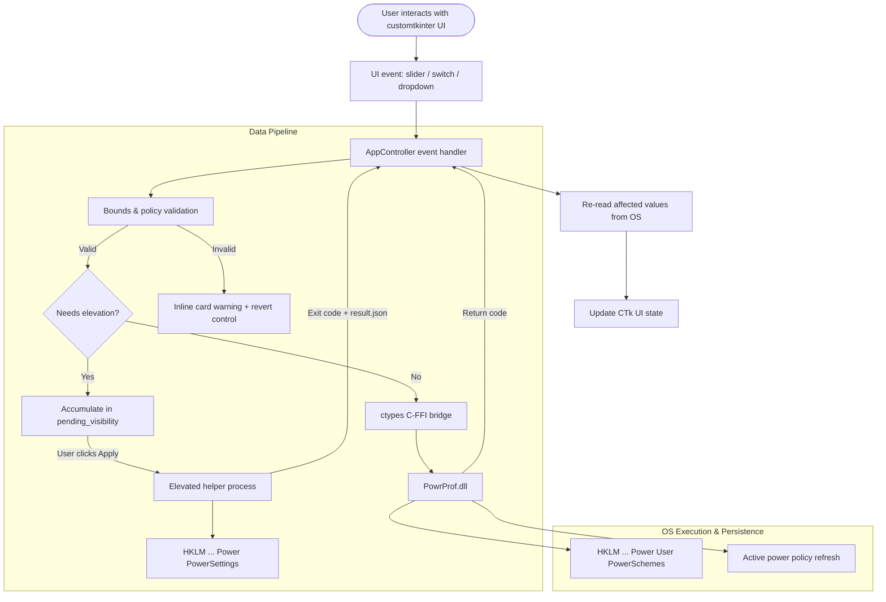
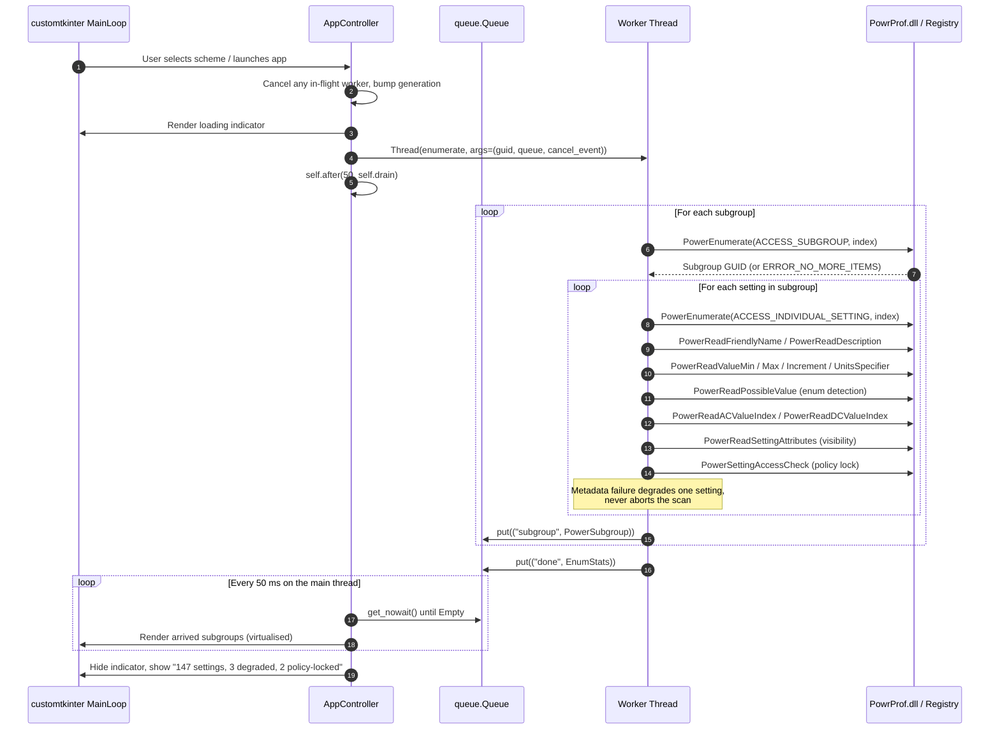
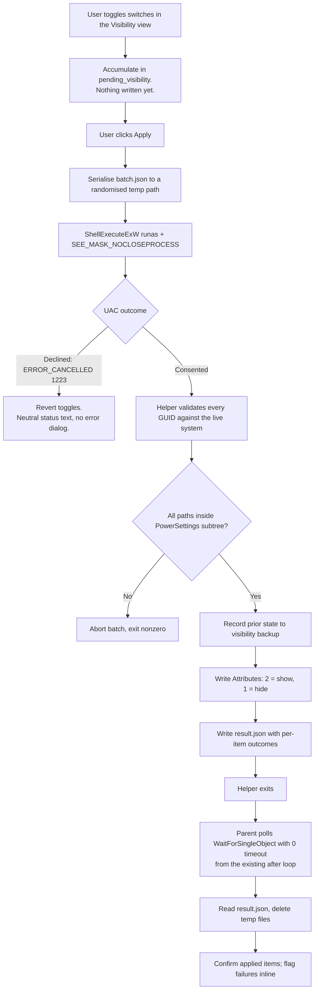

# Data Flow and Configuration Schema

* **Document Version:** 2.0.0
* **Target Stack:** Python 3.10+, `ctypes`, `customtkinter` 6.0.0
* **Related Documents:** [[Index]], [[Product Requirements Document]], [[Technical Design Document]], [[Win32 API Reference]], [[Architecture Decision Records]], [[Recovery and Destructive Operations]]

---

## 1. Data Flow Architecture

### 1.1 Overview & System Boundaries
Windows Power Explorer operates without a database. The **Windows Registry** and the **`PowrProf.dll` subsystem** are the single source of truth for all power data (ADR-005). A small UI-state file holds window geometry and last-selection only — never power data.



Note the final step: after any write the app **re-reads from the OS** rather than assuming its own value took. This is what keeps ADR-005 honest and prevents the UI from displaying a value the registry does not hold.

---

### 1.2 Read & Enumeration Sequence

Enumeration runs off the main thread and communicates **only through a queue** — no worker thread ever calls a Tk method, including `after` (ADR-003).



---

### 1.3 Write & Mutate Sequence

```mermaid
sequenceDiagram
    autonumber
    participant UI as SettingCardWidget
    participant Ctrl as AppController
    participant Win32 as PowrProf.dll

    UI->>Ctrl: on_ac_change(setting_guid, new_value)
    Ctrl->>Ctrl: Validate min <= value <= max, honour increment

    alt Out of bounds
        Ctrl-->>UI: Reject; reset control to the OS value
    else Policy-locked
        Ctrl-->>UI: Control was already disabled; ignore
    else Valid
        Ctrl->>Win32: PowerWriteACValueIndex(scheme, sub, setting, value)
        Win32-->>Ctrl: ERROR_SUCCESS (0)

        alt Edited scheme IS the active scheme
            Ctrl->>Win32: PowerSetActiveScheme(NULL, active_guid)
            Win32-->>Ctrl: Kernel applies the new policy live
        else Edited scheme is NOT active
            Note over Ctrl: No refresh call. The value is already<br/>persisted and applies when this scheme<br/>is next activated.
        end

        Ctrl->>Win32: PowerReadACValueIndex (confirm what the OS actually holds)
        Win32-->>Ctrl: Stored value
        Ctrl-->>UI: Update control from the OS value; success badge
    end
```

> [!CAUTION]
> **The conditional refresh in step 6 is not an optimisation — it is a correctness
> requirement.** `PowerSetActiveScheme(NULL, guid)` *makes* `guid` the active plan.
> Calling it unconditionally after editing a scheme the user is merely inspecting
> silently switches their machine onto it. This corrects the unconditional refresh
> specified in v1.0.0.

---

### 1.4 Elevation Data Flow (ADR-008)

Visibility changes are batched and applied by a short-lived elevated helper. The GUI is never relaunched elevated.



The parent never blocks on the helper — a blocking wait would freeze the GUI behind the UAC dialog.

---

## 2. Configuration & Data Schemas

### 2.1 Internal Python Data Model (`core/models.py`)

```python
from dataclasses import dataclass, field
from enum import Enum


class ControlType(Enum):
    """Inferred from live metadata — see [[Win32 API Reference]] §6.6."""
    ENUM = "enum"          # PowerReadPossibleValue succeeded → CTkOptionMenu
    TOGGLE = "toggle"      # range is exactly 0..1        → CTkSwitch
    RANGE = "range"        # min < max                    → CTkSlider
    READONLY = "readonly"  # bounds unreadable            → CTkLabel


@dataclass
class SettingValueChoice:
    """A discrete choice for an enumerated power setting."""
    value_index: int
    friendly_name: str
    description: str


@dataclass
class PowerSetting:
    """An individual Windows power setting (e.g. CPU boost mode)."""
    guid: str
    subgroup_guid: str
    friendly_name: str                    # "" when Windows supplies none
    description: str
    control_type: ControlType

    # Visibility is GLOBAL, not per-scheme (ADR-006). Present on this model
    # for convenience, but it does not vary between schemes.
    is_hidden: bool                       # From PowerReadSettingAttributes
    is_policy_locked: bool                # From PowerSettingAccessCheck
    is_degraded: bool                     # Metadata partially unreadable
    has_friendly_name: bool               # False → render the GUID instead

    value_units: str                      # "%", "Seconds", "Index", ""
    min_value: int | None
    max_value: int | None
    value_increment: int | None           # Never 0; coerced to 1

    ac_value: int | None                  # None when unreadable
    dc_value: int | None                  # None on machines with no battery

    choices: list[SettingValueChoice] = field(default_factory=list)
    hazard_note: str | None = None        # Inline warning; never blocks


@dataclass
class PowerSubgroup:
    """A category subgroup (e.g. Processor power management)."""
    guid: str
    friendly_name: str
    description: str
    is_hidden: bool                       # Subgroup-level visibility attribute
    settings: list[PowerSetting] = field(default_factory=list)


@dataclass
class PowerScheme:
    """A complete power scheme (e.g. Balanced, High Performance)."""
    guid: str
    friendly_name: str
    description: str
    is_active: bool
    is_base_default: bool                 # Built-in OS scheme; cannot be deleted
    subgroups: list[PowerSubgroup] = field(default_factory=list)


@dataclass
class OverlayInfo:
    """Windows 11 power mode overlay — read-only (ADR-009)."""
    guid: str
    friendly_name: str                    # "Best performance", etc.
    is_balanced: bool                      # True → no explanatory banner needed


@dataclass
class EnumStats:
    """Summary reported to the status bar after enumeration."""
    subgroup_count: int
    setting_count: int
    degraded_count: int
    policy_locked_count: int
    elapsed_ms: int


@dataclass(frozen=True)
class ValueChange:
    """One edit, retained for single-level undo (REQ-11.1). Never persisted."""
    scheme_guid: str
    subgroup_guid: str
    setting_guid: str
    rail: str                             # "ac" | "dc"
    previous_value: int
    new_value: int


@dataclass(frozen=True)
class SettingDiff:
    """One row of a scheme comparison (REQ-8.1)."""
    setting_guid: str
    subgroup_guid: str
    friendly_name: str
    ac_left: int | None
    ac_right: int | None
    dc_left: int | None
    dc_right: int | None

    @property
    def differs(self) -> bool:
        return (self.ac_left != self.ac_right) or (self.dc_left != self.dc_right)
```

> [!NOTE]
> **`PowerSetting` above is the flattened view the UI renders.** It is assembled on demand
> from a `SettingCatalogEntry` plus the active `SchemeValues` (ADR-012) — it is not the
> shape the enumeration workers produce, and it is never the thing that gets cached.
> `is_hidden` and `is_policy_locked` come from the catalog and are identical across
> schemes; `ac_value` and `dc_value` come from the per-scheme values.

---

### 2.2 Portable JSON Preset Schema

Users export and share scheme configurations as portable JSON. This is our own format — there is no `.pow` export API (ADR-007).

#### Schema Definition (`schema/power_preset.schema.json`)

```json
{
  "$schema": "http://json-schema.org/draft-07/schema#",
  "title": "WindowsPowerExplorerPreset",
  "type": "object",
  "required": ["version", "preset_name", "base_template_guid", "settings"],
  "additionalProperties": false,
  "properties": {
    "version": {
      "type": "string",
      "pattern": "^\\d+\\.\\d+$",
      "description": "Preset format version, independent of app version."
    },
    "preset_name": { "type": "string", "minLength": 1, "maxLength": 256 },
    "description": { "type": "string", "maxLength": 1024 },
    "base_template_guid": {
      "type": "string",
      "pattern": "^[0-9a-fA-F]{8}-[0-9a-fA-F]{4}-[0-9a-fA-F]{4}-[0-9a-fA-F]{4}-[0-9a-fA-F]{12}$"
    },
    "exported_by": {
      "type": "object",
      "description": "Provenance. Informational only; never trusted on import.",
      "properties": {
        "app_version": { "type": "string" },
        "windows_build": { "type": "string" },
        "exported_at": { "type": "string", "format": "date-time" }
      }
    },
    "settings": {
      "type": "array",
      "maxItems": 2048,
      "items": {
        "type": "object",
        "required": ["subgroup_guid", "setting_guid"],
        "additionalProperties": false,
        "properties": {
          "subgroup_guid": {
            "type": "string",
            "pattern": "^[0-9a-fA-F]{8}-[0-9a-fA-F]{4}-[0-9a-fA-F]{4}-[0-9a-fA-F]{4}-[0-9a-fA-F]{12}$"
          },
          "setting_guid": {
            "type": "string",
            "pattern": "^[0-9a-fA-F]{8}-[0-9a-fA-F]{4}-[0-9a-fA-F]{4}-[0-9a-fA-F]{4}-[0-9a-fA-F]{12}$"
          },
          "setting_name": {
            "type": "string",
            "description": "Human aid for reading the file. Ignored on import."
          },
          "ac_value": { "type": "integer", "minimum": 0, "maximum": 4294967295 },
          "dc_value": { "type": "integer", "minimum": 0, "maximum": 4294967295 },
          "unhide_in_control_panel": {
            "type": "boolean",
            "description": "Requires Administrator on import. Applies system-wide."
          }
        }
      }
    }
  }
}
```

> [!NOTE]
> `jsonschema` is a **test-time dependency only**. The shipped app validates imports with
> hand-written checks so no fourth runtime dependency is bundled ([[Build Packaging and Release]] §3).
> This schema file is the contract those checks are tested against.

#### Import Validation Order

Every step must pass before **anything** is written. Details in [[Recovery and Destructive Operations]] §7.

1. Parses as JSON; file under 1 MB.
2. Conforms to the schema above.
3. Every GUID matches the canonical pattern.
4. Every referenced setting exists on this machine — unknown GUIDs are collected and reported, not fatal.
5. Every value falls within that setting's **live** `Min`/`Max` on this machine; out-of-range values are **clamped with a warning**, since hardware differs between machines.
6. `preset_name` contains no NUL bytes and is at most 256 characters.
7. A **diff preview** is shown and confirmed before the first write.

#### Example (`presets/quiet_gaming.json`)

```json
{
  "version": "1.0",
  "preset_name": "Quiet Gaming Laptop",
  "description": "Disables CPU Turbo Boost to keep laptop fans silent while preserving GPU performance.",
  "base_template_guid": "8c5e7fda-e8bf-4a96-9a85-a6e23a8c635c",
  "exported_by": {
    "app_version": "1.0.0",
    "windows_build": "26200",
    "exported_at": "2026-08-16T18:24:01Z"
  },
  "settings": [
    {
      "subgroup_guid": "fea3413e-7e05-4911-9a71-700331f1c294",
      "setting_guid": "245d8541-3943-4422-b025-13a784f679b7",
      "setting_name": "Power plan personality",
      "ac_value": 1,
      "dc_value": 0
    },
    {
      "subgroup_guid": "54533251-82be-4824-96c1-47b60b740d00",
      "setting_guid": "be337238-0d82-4146-a960-4f3749d470c7",
      "setting_name": "Processor performance boost mode",
      "ac_value": 0,
      "dc_value": 0,
      "unhide_in_control_panel": true
    },
    {
      "subgroup_guid": "54533251-82be-4824-96c1-47b60b740d00",
      "setting_guid": "bc502fe6-701e-46c4-9826-5d42490a1e9c",
      "setting_name": "Maximum processor state",
      "ac_value": 100,
      "dc_value": 80
    }
  ]
}
```

The personality setting is included first deliberately — a preset that omits it may not behave as its author intended (REQ-1.4).

---

### 2.3 UI State File (ADR-005 amendment)

`%LOCALAPPDATA%\WindowsPowerExplorer\ui-state.json`. Contains **no power data**; deleting it is always safe.

Under portable mode (ADR-014) the same file lives in `data/` beside the executable instead.

```json
{
  "version": 2,
  "window": { "width": 1150, "height": 720, "x": 384, "y": 156, "maximized": false },
  "appearance_mode": "System",
  "last_selected_scheme_guid": "f4e6f13e-4efd-435f-adb4-fc42d20a1537",
  "last_selected_category": "54533251-82be-4824-96c1-47b60b740d00",
  "show_modified_only": false,
  "favorites": [
    ["54533251-82be-4824-96c1-47b60b740d00", "be337238-0d82-4146-a960-4f3749d470c7"],
    ["238c9fa8-0aad-41ed-83f4-97be242c8f20", "29f6c1db-86da-48c5-9fdb-f2b67b1f44da"]
  ],
  "last_visibility_batch_hash": "sha256:1f3a…"
}
```

Read defensively: any parse error, missing key, unknown `version`, or out-of-range geometry falls back to defaults silently. Off-screen window positions (a monitor was disconnected) are clamped back onto a visible display. Favorite entries referencing settings absent on this machine are dropped on load rather than rendered as broken rows.

`last_visibility_batch_hash` supports REQ-3.7 — detecting that a Windows feature update reset visibility attributes since the last applied batch.

### 2.5 Presentational Data Files

`data/essentials.json`, `data/reboot_required.json`, and `data/doc_links.json` ship with the app. They are **UI metadata, not power data** — they describe how to present a setting, never what its value is, so ADR-005 is unaffected.

```json
// data/reboot_required.json
{
  "version": 1,
  "settings": [
    {
      "setting_guid": "9d7815a6-7ee4-497e-8888-515a05f02364",
      "reason": "reboot",
      "note": "Takes effect after restarting Windows."
    },
    {
      "setting_guid": "5ca83367-6e45-459f-a27b-476b1d01c936",
      "reason": "power_source_change",
      "note": "Applies when the power source next changes."
    }
  ]
}
```

Each file is **optional and independently degradable**: missing, unparseable, or referencing unknown GUIDs disables that one presentational feature and logs a `WARNING`. None may block startup, and none may affect a read or write path. Entries for settings absent on the machine are ignored silently — these lists are maintained against Windows in general, not against any one PC.

---

### 2.4 Native Windows Registry Layout

Two separate trees, commonly confused. **They serve different purposes and one of them is not per-scheme.**

#### Scheme values — per-scheme, Standard User writable via API

```text
HKLM\SYSTEM\CurrentControlSet\Control\Power\User\PowerSchemes
└── {Scheme_GUID}                     e.g. 381b4222-f694-41f0-9685-ff5bb260df2e
    ├── FriendlyName                  REG_SZ / REG_EXPAND_SZ
    ├── Description                   REG_SZ
    └── {SubGroup_GUID}               e.g. 54533251-82be-4824-96c1-47b60b740d00
        └── {Setting_GUID}            e.g. be337238-0d82-4146-a960-4f3749d470c7
            ├── ACSettingIndex        REG_DWORD  Plugged-in configured value
            └── DCSettingIndex        REG_DWORD  On-battery configured value
```

> [!IMPORTANT]
> **There is no `Attributes` value anywhere in this tree.** v1.0.0 of this document
> placed it here, which is what led to the incorrect assumption that visibility is
> per-scheme.

`FriendlyName` on built-in schemes is often an indirect resource reference (`@%SystemRoot%\system32\powrprof.dll,-1`). Do not parse it — `PowerReadFriendlyName` resolves and localizes it.

We read this tree only for `--verbose` diagnostics. All writes go through `PowerWrite*ValueIndex` so Windows performs its own validation and policy refresh.

#### Visibility attributes — global, Administrator required

```text
HKLM\SYSTEM\CurrentControlSet\Control\Power\PowerSettings
└── {SubGroup_GUID}
    ├── Attributes                    REG_DWORD  ← subgroup-level visibility
    └── {Setting_GUID}
        ├── Attributes                REG_DWORD  ← 1 = hidden, 2 = shown
        ├── Description               (OS-supplied metadata, read-only to us)
        └── FriendlyName              (OS-supplied metadata, read-only to us)
```

**Properties of this tree that shape the product:**

* **Scheme-independent.** One `Attributes` value governs a setting's visibility across every power plan.
* **Machine-wide.** It lives in `HKLM` and affects every user account.
* **Sparse.** Bare GUID keys carry no `Attributes` value until one is written. Restoring "original" state means *deleting* the value, not writing `1` over it.
* **Volatile across updates.** Windows feature updates reset these to defaults. Configured AC/DC values in the other tree survive.
* **`2` is the working reveal value** and is undocumented (ADR-006).

Only the elevated helper writes here, and only the `Attributes` value name, only as `REG_DWORD`, only as `1` or `2` ([[Technical Design Document]] §5.2).
