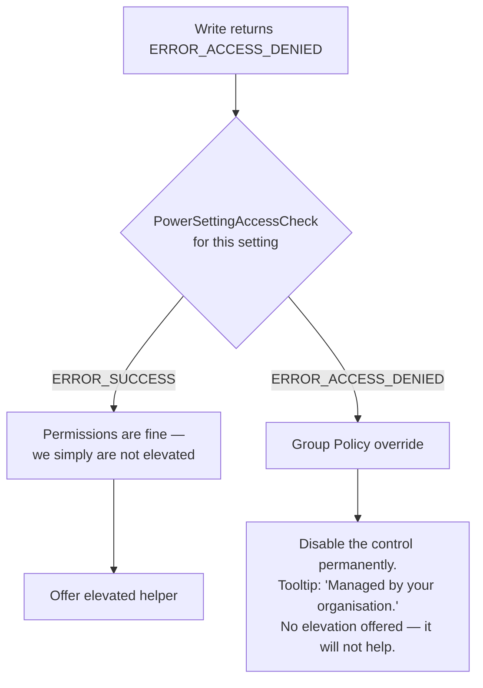

# Error Handling and Logging

* **Document Version:** 1.0.0
* **Target Stack:** Python 3.10+, `ctypes`, `customtkinter`, `logging`
* **Related Documents:** [[Index]], [[Win32 API Reference]], [[Technical Design Document]], [[CLI and UX Interface Specification]], [[Recovery and Destructive Operations]]

---

## 1. Principles

1. **Never surface a raw Win32 code to a user.** Every nonzero return is mapped to a plain-language sentence. The numeric code goes to the log and to `--verbose` output only.
2. **A failed write must never leave the UI lying.** If a write fails, the control reverts to the value the OS actually holds — re-read it, do not just restore the previous widget state.
3. **Declining a UAC prompt is not an error.** It is a user choice and gets a neutral status message, never an error dialog.
4. **A single unreadable setting must not abort enumeration.** Hardware and OEM drivers expose settings with missing metadata; skip and log, never fail the whole scan.
5. **The app has no network access, so nothing is ever reported anywhere.** Logs are local files the user can read, attach to a GitHub issue, or delete.

---

## 2. Exception Hierarchy

```python
class PowerExplorerError(Exception):
    """Base for every error this application raises."""


class PowerApiError(PowerExplorerError):
    """A powrprof.dll call returned a nonzero status."""

    def __init__(self, function: str, code: int, context: str = ""):
        self.function = function
        self.code = code
        self.context = context
        super().__init__(f"{function} failed with {code}: {user_message(code)}")


class ElevationRequiredError(PowerExplorerError):
    """Operation needs Administrator and we are not elevated."""


class ElevationDeclinedError(PowerExplorerError):
    """User dismissed the UAC consent prompt. Not a failure."""


class ValueOutOfBoundsError(PowerExplorerError):
    """Proposed value violates the setting's min/max/increment."""


class PolicyLockedError(PowerExplorerError):
    """A Group Policy override forbids modifying this setting."""


class SchemeNotFoundError(PowerExplorerError):
    """Named or GUID-identified scheme does not exist."""


class SettingNotFoundError(PowerExplorerError):
    """Setting GUID does not exist in the given subgroup."""


class PresetValidationError(PowerExplorerError):
    """Imported JSON preset failed schema or semantic validation."""
```

---

## 3. Win32 Code → User Message Map

Every `PowerApiError` is rendered through this table. The **Recovery** column drives what the UI offers alongside the message.

| Code | Constant | User-facing message | Recovery |
| ---: | :--- | :--- | :--- |
| `2` | `ERROR_FILE_NOT_FOUND` | "That power scheme or setting no longer exists. Refreshing the list." | Auto-trigger `Ctrl+R` refresh |
| `5` | `ERROR_ACCESS_DENIED` | "This change needs Administrator permission." | Offer elevation, or report policy lock if `PowerSettingAccessCheck` failed |
| `13` | `ERROR_INVALID_DATA` | "Windows rejected that value for this setting." | Revert control to OS value |
| `87` | `ERROR_INVALID_PARAMETER` | "Windows rejected that value for this setting." | Revert control to OS value |
| `1223` | `ERROR_CANCELLED` | "Change cancelled." *(status bar, not a dialog)* | Revert toggle silently |
| `234` | `ERROR_MORE_DATA` | *(never shown — retry internally)* | Resize buffer and retry once |
| `259` | `ERROR_NO_MORE_ITEMS` | *(never shown — normal loop terminator)* | None |
| *other* | — | "Windows reported an unexpected error (code *N*) while *doing X*." | Offer "Copy details" for a bug report |

```python
_MESSAGES = {
    2:    "That power scheme or setting no longer exists.",
    5:    "This change needs Administrator permission.",
    13:   "Windows rejected that value for this setting.",
    87:   "Windows rejected that value for this setting.",
    1223: "Change cancelled.",
}


def user_message(code: int, action: str = "applying your change") -> str:
    return _MESSAGES.get(
        code, f"Windows reported an unexpected error (code {code}) while {action}."
    )
```

### 3.1 Disambiguating `ERROR_ACCESS_DENIED`

Code `5` has two very different causes, and offering a UAC prompt for the wrong one wastes the user's time and fails anyway:



Group-policy-locked settings are detected **during enumeration**, not on first write, so the control renders disabled from the outset rather than failing under the user's hands.

---

## 4. Error Surfaces

The same error reaches the user through a different surface depending on severity and context.

| Surface | Use for | Implementation |
| :--- | :--- | :--- |
| **Status bar text** | Success confirmations, cancellations, transient info | `CTkLabel` in the footer, auto-clears after 4 s |
| **Inline card badge** | A single setting failed to read or write | Small coloured label inside the affected `SettingCardWidget` |
| **Modal dialog** | Destructive confirmations, elevation prompts, import failures | Our own `ConfirmDialog` on `CTkToplevel` — see [[Design Specification]] §4 |
| **Startup error window** | Binding verification failed, `powrprof.dll` unusable | Plain `CTkToplevel` with copyable text and an Exit button |
| **stderr + exit code** | Every CLI failure | See [[CLI and UX Interface Specification]] §2.3 |

Rule: **an error caused by one setting is reported on that setting**, never as a modal that interrupts the whole app.

---

## 5. Enumeration Resilience

A setting is *degraded*, not fatal, when metadata is missing. The `PowerSetting` model carries the degradation so the UI can render honestly.

| Failure during enumeration | Handling |
| :--- | :--- |
| `PowerReadFriendlyName` empty or fails | Display the GUID with an "Unknown setting" label. Setting remains editable. |
| `PowerReadDescription` empty or fails | Omit the description line entirely — no placeholder text. |
| Bounds calls (`Min`/`Max`/`Increment`) fail | Render a read-only value label instead of a slider. Flag `is_editable = False`. |
| `PowerReadPossibleValue` fails at index 0 | Not an enum setting. Fall through to bounds-based control inference. |
| `increment == 0` | Treat as `1`. Never divide by it. |
| `PowerReadACValueIndex` fails | Show "—" for that rail. A desktop with no battery legitimately has no DC values. |
| Subgroup enumeration throws mid-loop | Log, keep the subgroups already collected, continue to the next. |

Every skip is logged at `WARNING` with the subgroup and setting GUID. A summary line at the end of enumeration reports the count: `Enumerated 147 settings across 11 subgroups (3 degraded, 2 policy-locked)`.

---

## 6. Logging

### 6.1 Configuration

```python
import logging, os
from logging.handlers import RotatingFileHandler
from pathlib import Path

LOG_DIR = Path(os.environ["LOCALAPPDATA"]) / "WindowsPowerExplorer" / "logs"


def configure_logging(verbose: bool = False) -> None:
    LOG_DIR.mkdir(parents=True, exist_ok=True)

    handler = RotatingFileHandler(
        LOG_DIR / "power-explorer.log",
        maxBytes=1_048_576,      # 1 MB
        backupCount=3,           # 4 MB total ceiling
        encoding="utf-8",
    )
    handler.setFormatter(logging.Formatter(
        "%(asctime)s %(levelname)-8s %(name)-24s %(message)s"
    ))

    root = logging.getLogger()
    root.setLevel(logging.DEBUG if verbose else logging.INFO)
    root.addHandler(handler)
```

Location: `%LOCALAPPDATA%\WindowsPowerExplorer\logs\power-explorer.log`, rotating at 1 MB with 3 backups — a hard 4 MB ceiling, so a runaway loop cannot fill the user's disk.

The elevated helper writes to `power-explorer-helper.log` in the same directory, so its output is never interleaved with the main process's.

### 6.2 Levels

| Level | Content |
| :--- | :--- |
| `DEBUG` | Every FFI call: function, GUID arguments, return code, elapsed µs. Enabled by `--verbose` only. |
| `INFO` | Lifecycle events: startup, enumeration summary, scheme created/deleted/activated, value written, elevation requested and its outcome. |
| `WARNING` | Degraded settings, retried buffers, missing overlay exports, unknown GUIDs in an imported preset. |
| `ERROR` | Failed writes, failed imports, helper process nonzero exit. |
| `CRITICAL` | Binding verification failure, `powrprof.dll` load failure — always followed by exit. |

### 6.3 What Never Goes in the Log

The app handles no personal data, and the log must stay safe to paste into a public issue:

* No `%USERPROFILE%` paths — log paths relative to a redacted `~`.
* No machine name, domain, or username.
* User-authored scheme names are logged at `DEBUG` only. `INFO` lines reference schemes by GUID.

### 6.4 Startup Header

Every session begins with a single block that turns a pasted log into a usable bug report:

```text
2026-08-16 18:24:01 INFO     app                      Windows Power Explorer 1.0.0
2026-08-16 18:24:01 INFO     app                      Windows 11 26200 (x64) | Python 3.12.4 | frozen=onefile
2026-08-16 18:24:01 INFO     app                      Elevated: no | Modern Standby: yes | Overlays: supported
```

---

## 7. Crash Handling

An unhandled exception on the main thread must not vanish behind a closing window.

```python
import sys, traceback


def install_crash_handler(app) -> None:
    def hook(exc_type, exc, tb):
        logging.critical("Unhandled exception", exc_info=(exc_type, exc, tb))
        details = "".join(traceback.format_exception(exc_type, exc, tb))
        show_crash_dialog(app, details, LOG_DIR / "power-explorer.log")

    sys.excepthook = hook
    app.report_callback_exception = lambda *a: hook(*sys.exc_info())
```

`tkinter` swallows exceptions raised inside widget callbacks, routing them to `report_callback_exception`. Overriding **both** `sys.excepthook` and that attribute is required — neither alone catches everything.

The crash dialog shows the traceback in a read-only `CTkTextbox`, a **Copy details** button, and the log file path. No automatic reporting.

**Worker threads** never raise into the void: the worker body is wrapped so any exception is captured and posted to the result queue as a failure message, which the main thread renders through §4.

---

## 8. CLI Error Output

CLI errors go to `stderr` in a stable, greppable shape, with the process exit code from [[CLI and UX Interface Specification]] §2.3.

```text
error: scheme not found: 'Esports Ultr'
hint:  run 'power-explorer list-schemes' to see available schemes
```

Under `--json`, errors are emitted as a JSON object on `stdout` so that scripts have exactly one thing to parse, and `stderr` stays clean:

```json
{
  "ok": false,
  "error": {
    "code": "ERR_SCHEME_NOT_FOUND",
    "exit_code": 2,
    "message": "scheme not found: 'Esports Ultr'",
    "win32_code": null
  }
}
```

`win32_code` carries the raw DWORD when the failure originated in `powrprof.dll`, and is `null` otherwise. Successful `--json` commands emit `{"ok": true, "data": ...}` so the envelope is uniform.
