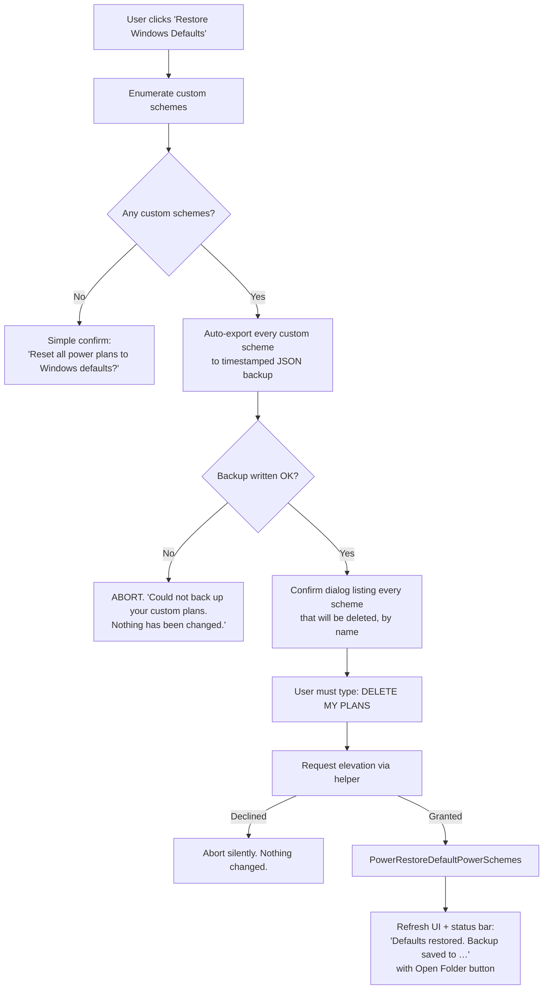

# Recovery and Destructive Operations

* **Document Version:** 1.0.0
* **Related Documents:** [[Index]], [[Win32 API Reference]], [[Threat Model and Security Checklist]], [[Error Handling and Logging]], [[CLI and UX Interface Specification]]

---

## 1. Why This Document Exists

The Threat Model names "Restore Default Windows Power Schemes" as the failsafe for a misconfigured machine. That failsafe is `PowerRestoreDefaultPowerSchemes`, and **it deletes every custom power scheme on the machine** — including ones this app never created. Presenting it as a friendly "reset" button would destroy user work.

This document specifies every operation that can lose data or destabilise a machine, and the confirmation each one requires.

---

## 2. Destructive Operation Register

| Operation | Blast radius | Reversible? | Gate |
| :--- | :--- | :--- | :--- |
| **Delete scheme** | One custom scheme | Only from a prior JSON export | Typed-name confirmation |
| **Restore default schemes** | **All** custom schemes, system-wide | No | Typed-phrase confirmation + auto-backup |
| **Import preset (overwrite mode)** | One scheme's values | Only from a prior export | Diff preview + confirm |
| **Bulk unhide-all** | Global Control Panel visibility | Yes — `restore-visibility` | Confirm dialog + elevation |
| **Edit a sleep/timeout value to 0** | Machine may not sleep or may sleep instantly | Yes — revert the value | Inline warning, no block |
| **Edit min processor state to a very low value** | Perceived system slowness | Yes | Inline warning, no block |

Everything else — creating, renaming, switching schemes, ordinary AC/DC edits — is non-destructive and needs no confirmation.

---

## 3. `PowerRestoreDefaultPowerSchemes`

```python
powrprof.PowerRestoreDefaultPowerSchemes.argtypes = []
powrprof.PowerRestoreDefaultPowerSchemes.restype  = wintypes.DWORD
```

**What it actually does:** deletes all power schemes and recreates the Windows defaults. Custom schemes are gone, along with every AC/DC value the user tuned in them. It requires elevation and it does not prompt.

### 3.1 Required Flow



### 3.2 The Automatic Backup

Non-negotiable. Before the API is called, every custom scheme is exported to:

```text
%LOCALAPPDATA%\WindowsPowerExplorer\backups\restore-defaults-{YYYYMMDD-HHMMSS}\
├── manifest.json
├── My Custom Gaming Plan-{guid}.json
└── Quiet Laptop-{guid}.json
```

`manifest.json` records the app version, timestamp, Windows build, and which scheme was active. If **any** export fails, the whole operation aborts and nothing is deleted — a partial backup is worse than no reset.

Backups are never auto-deleted. A "Manage backups" entry in the UI shows their size and lets the user clear them explicitly.

### 3.3 Confirmation Copy

```text
┌─ Restore Windows Default Power Plans ──────────────────────┐
│                                                            │
│  This deletes ALL custom power plans on this computer,     │
│  including any created outside this app.                   │
│                                                            │
│  These 2 plans will be permanently deleted:                │
│    • My Custom Gaming Plan                                 │
│    • Quiet Laptop                                          │
│                                                            │
│  A backup has been saved to:                               │
│    …\WindowsPowerExplorer\backups\restore-defaults-…       │
│    [ Open folder ]                                         │
│                                                            │
│  Type  DELETE MY PLANS  to confirm:                        │
│  [                                        ]                │
│                                                            │
│                    [ Cancel ]  [ Restore Defaults ]        │
└────────────────────────────────────────────────────────────┘
```

The action button stays disabled until the phrase matches exactly. `Escape` and the window close button both cancel. **`Cancel` is the default focused control** — a stray `Enter` must never trigger this.

The phrase is deliberately not localized in v1.0; it is a fixed literal so that support instructions are unambiguous.

---

## 4. Delete Scheme

Lower stakes — one scheme — but still unrecoverable without a prior export.

**Guards:**

* Built-in schemes (Balanced, High Performance, Power Saver, Ultimate Performance) **cannot be deleted**. The control is absent, not merely disabled.
* Deleting the **active** scheme: Windows switches the machine to Balanced. The dialog must say so, because a silent plan switch is exactly the sort of surprise that erodes trust.
* Confirmation requires typing the **scheme's own name**, which forces the user to read which one they picked.

```text
Delete "My Custom Gaming Plan"?

This plan is currently active. Deleting it will switch this
computer to Balanced.

This cannot be undone. Export it first if you want to keep a copy.
                                              [ Export first ]

Type the plan name to confirm:
[                                        ]

                              [ Cancel ]  [ Delete ]
```

The **Export first** button performs a JSON export and, on success, leaves the dialog open with the confirmation field ready — the user does not have to start over.

---

## 5. Bulk Unhide and Visibility Restore

`unhide-all` writes `Attributes = 2` across every setting and subgroup under `HKLM\SYSTEM\CurrentControlSet\Control\Power\PowerSettings`. It is **system-wide and affects every user account on the machine**.

It is reversible, which is what separates it from §3. Before the batch runs, the helper records each key's prior `Attributes` value (or its absence) to:

```text
%LOCALAPPDATA%\WindowsPowerExplorer\backups\visibility-{YYYYMMDD-HHMMSS}.json
```

`restore-visibility` replays that file, deleting `Attributes` values that did not previously exist rather than writing `1` over them — restoring true original state, not an approximation.

**Confirmation:** a single dialog, no typed phrase. The operation is reversible and its consequence is cosmetic.

```text
Show all hidden power settings?

This reveals every advanced power setting in the Windows
Control Panel, for all users on this computer.

Administrator permission is required. You can undo this at
any time with "Restore Control Panel Defaults".

                              [ Cancel ]  [ Show All ]
```

> [!NOTE]
> **Windows feature updates reset these attributes.** A major Windows update restores the
> default hidden state, though it does not touch configured AC/DC values. The app should
> detect this on launch — visibility state differing from the last recorded batch — and
> offer to re-apply, rather than leaving the user to wonder what happened.

---

## 6. Hazardous Values: Warn, Do Not Block

Some in-range values can make a machine unpleasant or appear broken. The Threat Model calls these a denial-of-service vector, but blocking them would be wrong: these are legitimate settings, Windows permits them, and this app exists precisely to expose deep control.

**Policy: every value Windows accepts is permitted. Values with surprising consequences carry an inline warning.**

| Condition | Inline warning |
| :--- | :--- |
| Sleep / hibernate timeout set to `0` | "0 means never sleep on this power source." |
| Display timeout set to `0` | "0 means the display never turns off." |
| Minimum processor state below 5% | "Very low minimum states can make the system feel sluggish." |
| Maximum processor state below 50% | "This caps CPU speed to under half. Expect reduced performance." |
| Critical battery action set to *Do nothing* | "The system may lose power without warning when the battery is exhausted." |
| Lid close action set to *Do nothing* | "The laptop will stay awake with the lid closed." |

Warnings render as a muted label beneath the control. They never block, never require dismissal, and never fire a modal.

**Hard bounds are still enforced.** Values outside the setting's `PowerReadValueMin`/`Max` are rejected before the write with `ValueOutOfBoundsError`, because Windows would reject them anyway with a less helpful message. Sliders cannot produce out-of-range values by construction; this guards the CLI and JSON import paths.

---

## 7. Import Safety

Imported presets are untrusted input — they may come from a forum post.

**Validation order** — every step must pass before anything is written:

1. File parses as JSON and is under 1 MB.
2. Structure matches the preset schema (required keys, correct types).
3. Every `subgroup_guid` and `setting_guid` matches the canonical GUID pattern.
4. Every referenced setting **exists on this machine**. Unknown GUIDs are collected, not fatal.
5. Every value falls within that setting's live `Min`/`Max` on this machine.
6. Scheme names contain no NUL bytes and are at most 256 characters.

**Then show a diff before writing anything:**

```text
Import "Quiet Gaming Laptop"

  Creates a new plan from: High Performance

  14 settings will be applied:
    Processor performance boost mode      AC: Aggressive → Disabled
    Maximum processor state               AC: 100% → 100%  (no change)
    …

  ⚠ 2 settings in this file do not exist on this computer
    and will be skipped:
    • be337238-0d82-4146-a960-4f3749d470c7
    • 45bcc044-d885-43e2-8605-ee0ec6e96b59

  ⚠ 1 setting requests Control Panel visibility changes,
    which needs Administrator permission.

                              [ Cancel ]  [ Import ]
```

Imports **always create a new scheme** by default; they never silently overwrite an existing one. Overwriting is a separate, explicitly chosen mode that shows the same diff against current values.

Values outside this machine's bounds are **clamped with a warning**, not rejected — hardware differs between the exporting and importing machine, and a preset from a different CPU should still be largely usable.

---

## 8. What We Deliberately Do Not Do

* **No system restore point.** Creating one needs elevation plus WMI, may be disabled by policy, and takes tens of seconds. Our JSON backups are faster, more targeted, and always available.
* **No undo history or transaction log.** ADR-005 keeps the registry as the single source of truth; a shadow history would drift out of sync with changes made by `powercfg`, Control Panel, or OEM utilities. Export is the supported way to preserve a configuration.
* **No automatic backup before ordinary edits.** Individual AC/DC edits are trivially reversible by re-editing, and backing up on every slider drag would be noise.
* **No "safe mode" value clamping.** Covered in §6 — we warn, we do not paternalise.
