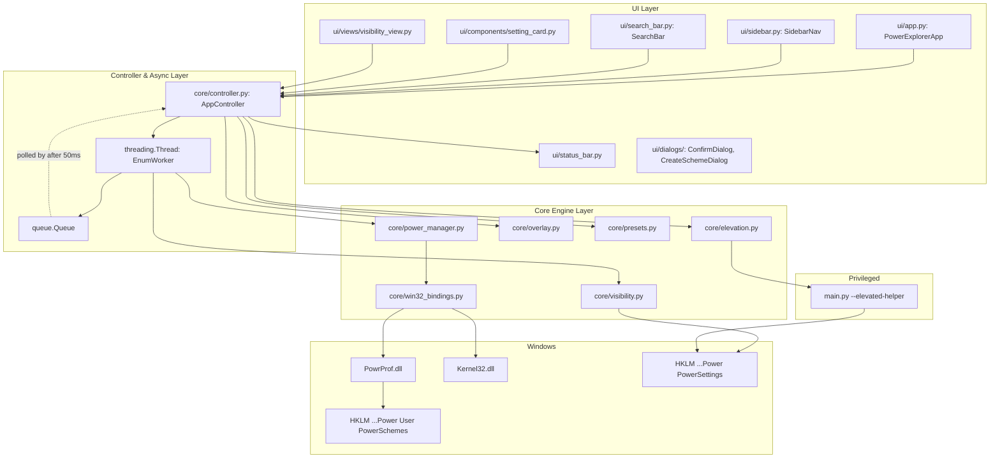
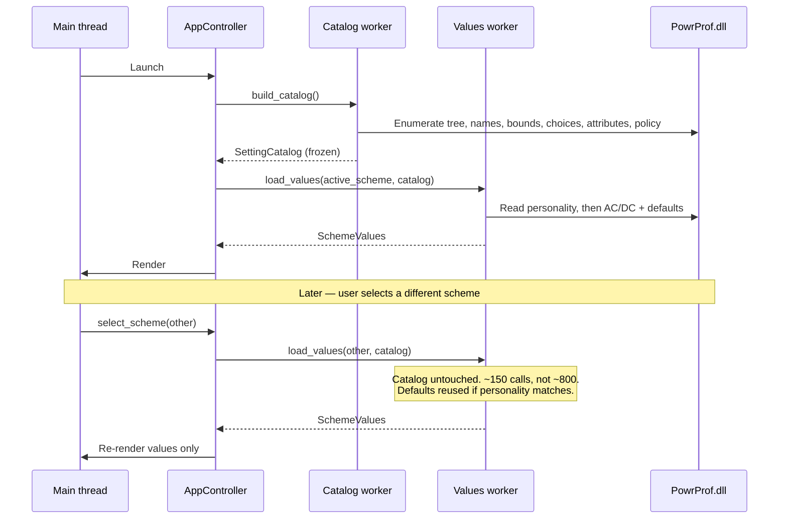
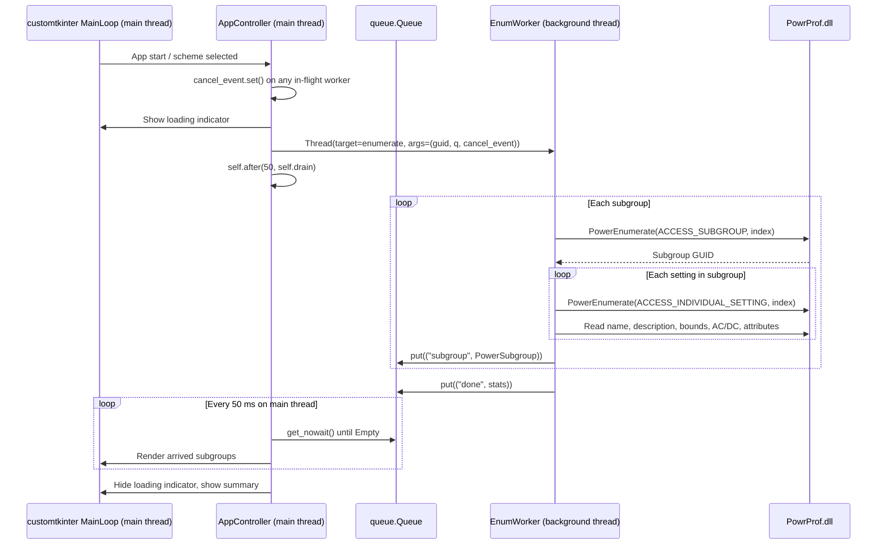
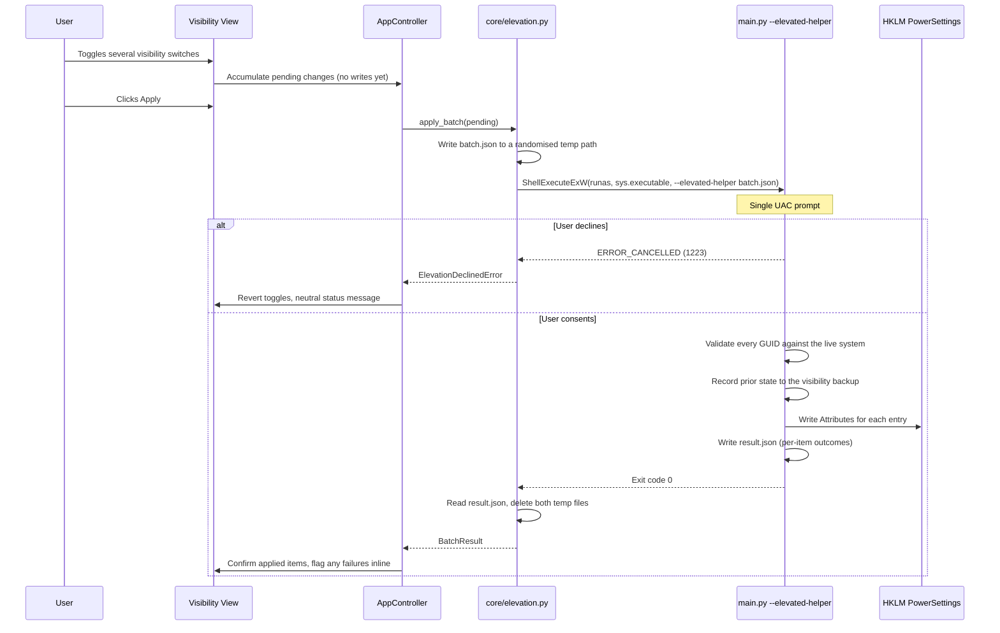
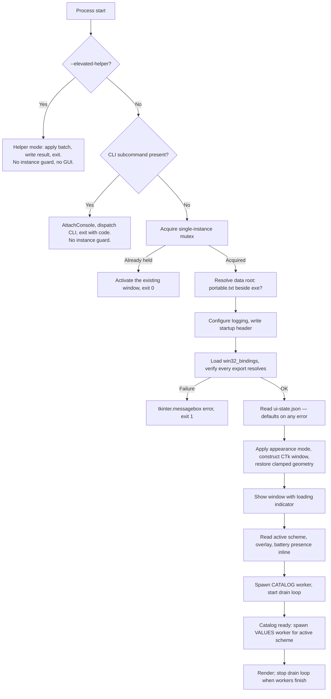

# Technical Design Document (TDD / RFC)

* **Document Version:** 2.0.0
* **Target Stack:** Python 3.10+, `ctypes`, `customtkinter` 6.0.0
* **Target Platforms:** Windows 10 (19041+) & Windows 11 (x64; ARM64 via emulation)
* **Related Documents:** [[Index]], [[Product Requirements Document]], [[Win32 API Reference]], [[Architecture Decision Records]], [[Design Specification]], [[Error Handling and Logging]]

> [!NOTE]
> Binding signatures previously inlined in this document have moved to
> **[[Win32 API Reference]]**, which is authoritative. This document covers architecture,
> threading, and control flow.

---

## 1. System Overview & Technical Goals

**Windows Power Explorer** is a lightweight Windows desktop application designed to replace legacy power utilities like *PowerSettingsExplorer*.

### Core Engineering Requirements
1. **Direct Win32 C-FFI interop:** call `PowrProf.dll`, `kernel32.dll`, and `shell32.dll` via `ctypes` without third-party C extensions, plus `winreg` for visibility attributes (ADR-006).
2. **Responsive threaded UI:** perform all multi-call Win32 enumerations off the main thread, communicating exclusively through a result queue (ADR-003).
3. **Robust C-memory management:** correctly allocate, marshal, and free native `GUID` structures and string buffers (`LocalFree`).
4. **Frictionless least-privilege elevation:** run as Standard User; delegate the few Administrator operations to a short-lived elevated helper (ADR-008).

---

## 2. Component Interaction



**Key structural points:**

* `AppController` is the only component both UI and core touch. UI never calls `power_manager` directly.
* The worker thread **never touches a Tk object**. It produces plain dataclasses into the queue.
* Visibility writes bypass `powrprof` entirely and go through the elevated helper.

---

## 3. Module Responsibilities

| Module | Owns | Must not |
| :--- | :--- | :--- |
| `core/win32_bindings.py` | `ctypes` prototypes, `GUID`, buffer protocol helpers, `LocalFree` lifetimes | Contain business logic or raise UI-facing errors |
| `core/power_manager.py` | Scheme CRUD, value read/write, bounds, policy checks | Import anything from `ui/`; know about threads |
| `core/catalog.py` | Phase-1 scheme-invariant catalog build and invalidation (ADR-012) | Read or hold any per-scheme value |
| `core/values.py` | Phase-2 per-scheme values; personality resolution; default-index cache | Rebuild the catalog |
| `core/compare.py` | Scheme-to-scheme diff; modified-from-default computation | Perform any FFI call — it operates on loaded data only |
| `core/visibility.py` | Reading attributes via API; **planning** registry writes as a batch | Perform privileged writes itself |
| `core/overlay.py` | Overlay detection, degrading silently when unsupported | Ever write an overlay |
| `core/controller.py` | Worker lifecycle, result queue, cancellation, app state | Contain widget code |
| `core/elevation.py` | Batch serialisation, `ShellExecuteExW`, result collection | Interpolate user strings into a command line |
| `core/presets.py` | JSON export, import validation, diff computation | Write to the registry directly |
| `core/script_export.py` | `powercfg` script and Markdown generation (ADR-013) | **Execute anything it generates** |
| `core/paths.py` | Portable vs `%LOCALAPPDATA%` root resolution, writability probe (ADR-014) | Cache the result across a permissions change |
| `core/instance.py` | Single-instance mutex, existing-window activation | Run in helper or CLI mode |
| `ui/*` | Widgets, layout, event binding | Call `ctypes` or `winreg` |

The dependency rule: **`ui/` may import `core/`; `core/` may never import `ui/`.** Enforced by a test that walks imports.

---

## 4. Two-Phase Load Architecture (ADR-012)

Six of the eight per-setting read families take **no scheme parameter at all** ([[Win32 API Reference]] §10.4). Enumeration is therefore split so that scheme switching re-reads only what actually varies.

| Phase | Contents | Cost | Rebuilt when |
| :--- | :--- | ---: | :--- |
| **Catalog** | Tree, names, descriptions, bounds, increments, units, possible values, visibility attributes, policy locks | ~700 FFI calls | Startup, `Ctrl+R`, after a visibility batch, on a value read returning `ERROR_FILE_NOT_FOUND` |
| **Values** | AC/DC values; defaults keyed by personality | ~150 FFI calls | Every scheme selection |

```python
@dataclass(frozen=True)
class SettingCatalogEntry:
    """Scheme-invariant. Immutable and hashable — safe to share across threads."""
    guid: str
    subgroup_guid: str
    friendly_name: str
    description: str
    control_type: ControlType
    min_value: int | None
    max_value: int | None
    value_increment: int | None
    value_units: str
    choices: tuple[SettingValueChoice, ...]
    is_hidden: bool
    is_policy_locked: bool
    is_degraded: bool


@dataclass
class SchemeValues:
    """Per-scheme. Defaults cached per personality, not per scheme."""
    scheme_guid: str
    personality_guid: str
    ac: dict[str, int | None]
    dc: dict[str, int | None]
    ac_default: dict[str, int | None]
    dc_default: dict[str, int | None]
```

### 4.1 Load Sequence



### 4.2 Catalog Staleness

The catalog is the one place this design holds OS-derived data across time, so it needs explicit invalidation. Settings genuinely appear and disappear — a driver install, a docking event, or a hardware change alters the tree.

**Invalidation triggers:** `Ctrl+R`; after any visibility batch (attributes are catalog data); and defensively, whenever a value read returns `ERROR_FILE_NOT_FOUND` for a catalogued setting, which means the tree moved underneath us. The last case rebuilds the catalog and retries once, then reports normally.

> [!NOTE]
> **This does not contradict ADR-005.** The catalog is session-scoped, never written to
> disk, and holds no configured values — only the OS's own description of which settings
> exist and what shape they take. Every value the user sees or edits is read live.

---

## 5. Threading Architecture

### 5.1 The Rule

`tkinter` is not thread-safe. **No thread other than the main thread may call any Tk method, including `after`.** The worker communicates only through `queue.Queue`; the main thread polls it.



### 5.2 Worker Contract

```python
import queue, threading

MSG_SUBGROUP = "subgroup"
MSG_DONE     = "done"
MSG_ERROR    = "error"
MSG_PROGRESS = "progress"


def enumerate_worker(scheme_guid: str,
                     out: queue.Queue,
                     cancel: threading.Event) -> None:
    """Runs off-thread. Touches no Tk object. Never raises."""
    try:
        stats = EnumStats()
        for index, subgroup in enumerate(power_manager.iter_subgroups(scheme_guid)):
            if cancel.is_set():
                return                       # Silent abandonment; no message.
            out.put((MSG_PROGRESS, index))
            out.put((MSG_SUBGROUP, subgroup))
            stats.observe(subgroup)
        out.put((MSG_DONE, stats))
    except Exception as exc:                  # Deliberately broad.
        logging.exception("Enumeration failed")
        out.put((MSG_ERROR, exc))
```

The bare `except Exception` is intentional: an exception escaping a thread target is printed to stderr and otherwise lost, leaving the UI spinning forever. Every failure must arrive as a message.

### 5.3 Cancellation

A user clicking through schemes faster than enumeration completes must not stack workers or render stale results.

* Each enumeration gets a `threading.Event`. Starting a new one sets the previous event.
* Each queue message carries a generation counter; the main thread discards messages from a superseded generation.
* Cancelled workers exit at the next subgroup boundary — within one subgroup's work, tens of milliseconds.
* Worker threads are `daemon=True` so a close during enumeration does not hang the process.

### 5.4 What Is *Not* Threaded

Single-call operations complete in well under a millisecond and run inline on the main thread. Threading them would add complexity and latency for nothing:

`PowerSetActiveScheme`, `PowerWriteACValueIndex` / `DCValueIndex`, `PowerDuplicateScheme`, `PowerDeleteScheme`, `PowerWriteFriendlyName`, overlay reads.

**Exceptions that must be threaded or deferred:** `PowerRestoreDefaultPowerSchemes` (can take seconds), preset import of many settings, and waiting on the elevated helper process — the last is handled by polling `WaitForSingleObject` with a zero timeout from the existing `after` loop rather than blocking.

### 5.5 Drain Loop Lifecycle

The drain loop must **not** run unconditionally. A `after(50, drain)` that reschedules forever is 20 wakeups per second for the life of the process — measurable idle CPU on a tool people leave open, and it breaks NFR-2c.

```python
def start_worker(self, target, *args):
    self.state.active_worker_count += 1
    threading.Thread(target=target, args=args, daemon=True).start()
    if self.state.active_worker_count == 1:
        self._drain_job = self.after(50, self.drain)


def drain(self):
    finished = 0
    try:
        while True:
            kind, payload = self.queue.get_nowait()
            if kind in (MSG_DONE, MSG_ERROR):
                finished += 1
            self.handle(kind, payload)
    except queue.Empty:
        pass

    self.state.active_worker_count -= finished
    if self.state.active_worker_count > 0:
        self._drain_job = self.after(50, self.drain)
    else:
        self._drain_job = None      # Idle: no scheduled work at all.
```

Between operations the app schedules nothing and consumes no CPU. The loop restarts on the next worker.

`self._drain_job` is retained so shutdown can `after_cancel` it — a pending `after` callback firing during teardown is a common source of `invalid command name` errors on close.

---

## 6. Elevation Architecture (ADR-008)

The GUI is never relaunched elevated. Privileged work is serialised to a batch file and executed by a short-lived child.



### 6.1 Batch File Format

```json
{
  "version": 1,
  "operation": "set_visibility",
  "issued_by_pid": 12345,
  "entries": [
    {
      "subgroup_guid": "54533251-82be-4824-96c1-47b60b740d00",
      "setting_guid": "be337238-0d82-4146-a960-4f3749d470c7",
      "visible": true
    }
  ]
}
```

### 6.2 Helper Hardening

The helper is the only privileged code, so it trusts nothing — **including the batch file**, since a local attacker could race a write to it:

* Accepts exactly one argument: an existing file path. No other flags parsed in helper mode.
* The batch file must sit in a directory writable only by the current user and Administrators.
* Every GUID is re-validated against the canonical pattern **and** confirmed to exist via `PowerEnumerate` before any write.
* Registry writes are confined to `HKLM\SYSTEM\CurrentControlSet\Control\Power\PowerSettings` and its subkeys. Any computed path outside that subtree aborts the batch.
* Only the `Attributes` value name is ever written, only as `REG_DWORD`, only with the values `1` or `2`.
* The helper never reads the UI-state file, never touches the network, and exits immediately after writing its result.

### 6.3 Polling Without Blocking

```python
def poll_helper(self, handle, on_done):
    rc = kernel32.WaitForSingleObject(handle, 0)   # non-blocking probe
    if rc == WAIT_TIMEOUT:
        self.after(100, lambda: self.poll_helper(handle, on_done))
        return
    code = wintypes.DWORD()
    kernel32.GetExitCodeProcess(handle, ctypes.byref(code))
    kernel32.CloseHandle(handle)
    on_done(code.value)
```

Blocking on `WaitForSingleObject(handle, INFINITE)` from the main thread would freeze the GUI behind the UAC dialog.

---

## 7. Rendering Strategy

A machine can expose well over a hundred settings. Each `SettingCardWidget` is several Canvas-drawn CTk widgets, and realising them all costs both memory and layout time.

**Preferred approach — virtualised rendering:** only cards intersecting the viewport (plus a small overscan) are constructed; scrolling recycles widgets rather than creating new ones.

* Card construction dominates first paint; virtualisation makes it proportional to viewport size, not setting count.
* Search filtering operates on the **data model**, then re-drives the virtual list — it never creates or destroys widgets per keystroke.
* Search input is debounced by 120 ms so a fast typist triggers one re-filter, not eight.

> [!WARNING]
> **This needs a spike before it is committed to.** `CTkScrollableFrame` has no
> virtualisation support. Implementing it means manually managing `grid`/`grid_forget`
> against measured scroll offsets inside a widget not designed for recycling, and CTk's
> internal canvas geometry is not a stable API. Budget a day to prove it, not an hour.

### 7.1 Fallback: Subgroup Pagination

If the spike goes badly, render **one subgroup at a time**. Category selection already exists in the sidebar, so the interaction model barely changes.

| | Virtualised | Subgroup pagination |
| :--- | :--- | :--- |
| Cards realised at once | ~15 (viewport) | ~10–25 (one subgroup) |
| Implementation risk | High — fights the framework | Low — plain `CTkScrollableFrame` |
| "All settings" view | Single continuous scroll | Grouped, one category at a time |
| Search across all settings | Inline in one list | Results view listing matches with their subgroup |

The fallback costs a little scrolling fluidity in the "All" view and nothing else. **It protects NFR-1, which is the only hard performance gate** — and a paginated app that never stutters is strictly better than a virtualised one that does.

Decide from the spike, then record the outcome here. Do not build both.

---

## 8. Application State

`AppController` holds a single state object; the UI renders from it and never holds authoritative state of its own.

```python
@dataclass
class AppState:
    # Phase 1 — scheme-invariant, rebuilt rarely
    catalog: SettingCatalog | None

    # Phase 2 — per scheme
    schemes: list[PowerScheme]
    active_scheme_guid: str | None
    selected_scheme_guid: str | None
    values: SchemeValues | None
    compare_scheme_guid: str | None       # Second scheme in the Compare view

    # Filtering
    selected_category: str                # subgroup GUID, "all", "essentials", "favorites"
    search_query: str
    show_modified_only: bool

    # System context
    overlay: OverlayInfo | None
    has_battery: bool                     # False → DC column hidden entirely
    is_elevated: bool

    # Pending & undo
    pending_visibility: dict[tuple[str, str], bool]   # (subgroup, setting) -> visible
    last_change: ValueChange | None       # Single-level undo (REQ-11.1)

    # Preferences, persisted to ui-state.json
    appearance_mode: str                  # "Light" | "Dark" | "System"
    favorites: set[tuple[str, str]]       # (subgroup GUID, setting GUID)

    # Worker coordination
    enumeration_generation: int
    active_worker_count: int              # Drives the drain loop lifecycle (§5.5)
```

`pending_visibility` is deliberately part of app state rather than widget state: toggles accumulate unapplied until **Apply**, and the Apply button's enabled state derives from whether it is empty.

`last_change` holds exactly one prior value and is cleared on scheme switch, refresh, or import (REQ-11.2) — a stale undo pointing at a value that no longer exists is worse than no undo.

### 8.1 Derived, Never Stored

These are computed from `catalog` + `values` on demand and must not be duplicated into state, or they will drift:

| Derived | From |
| :--- | :--- |
| Is this setting modified from default? | `values.ac[g] != values.ac_default[g]` |
| Scheme diff | Two `SchemeValues` against the shared catalog |
| Visible card list | catalog + category + search + `show_modified_only` |
| Is the Apply button enabled? | `bool(pending_visibility)` |

**Refresh triggers** — anything that could invalidate our view of the OS forces a re-read (ADR-005: no caching):

| Trigger | Scope |
| :--- | :--- |
| `Ctrl+R` | Full re-enumeration |
| Scheme selected | Settings for that scheme |
| Value written | The single affected setting, re-read from the OS |
| Scheme created / deleted / renamed | Scheme list |
| Visibility batch applied | Attributes for affected settings |
| Window regains focus | Active scheme GUID and overlay only — cheap, catches external `powercfg` changes |

---

## 9. Startup Sequence



The window is shown **before** enumeration begins. Users see a real window in well under a second even on the onefile artifact, with content filling in progressively — rather than staring at nothing while the catalog builds.

The startup error window deliberately uses `tkinter.messagebox` rather than our own `CTkToplevel`: when binding verification has failed, the CTk stack may itself be unusable, and this is the one dialog that must reach a screen-reader user (ADR-011).

---

## 10. Security & Elevation Model Summary

* **Standard User operations:** scheme creation, switching, deletion, renaming, AC/DC value edits, all reads, overlay reads, preset export. Windows grants Authenticated Users read/write/change on power policy objects.
* **Elevated operations:** visibility attribute writes and `PowerRestoreDefaultPowerSchemes`. Both go through the helper (§5).
* **Group Policy:** `PowerSettingAccessCheck` is called during enumeration. Policy-locked settings render disabled — elevation would not help and must not be offered.
* **Declined UAC** (`ERROR_CANCELLED`, 1223) is a normal outcome: revert the pending change, show neutral status text, never an error dialog.

Full analysis in [[Threat Model and Security Checklist]].
