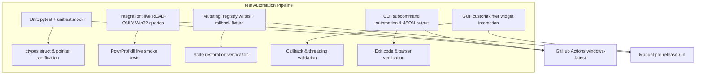

# Test Plan and Benchmark Targets

* **Document Version:** 2.0.0
* **Target Stack:** Python 3.10+, `ctypes`, `customtkinter` 6.0.0, `pytest`
* **Related Documents:** [[Index]], [[Product Requirements Document]], [[Technical Design Document]], [[Win32 API Reference]], [[CLI and UX Interface Specification]], [[Build Packaging and Release]], [[Threat Model and Security Checklist]]

---

## 1. Test Strategy & Scope

The framework ensures C-FFI safety, GUI responsiveness, and OS compatibility across Windows 10 and Windows 11.



> [!IMPORTANT]
> **Two suites cannot run in CI**, and pretending otherwise would give false confidence:
> * **GUI tests** — GitHub Actions runners have no interactive desktop session, so `CTk()`
>   cannot obtain a display.
> * **Elevation tests** — runners are always elevated, which makes the *non*-elevated code
>   path untestable there.
>
> Both are marked with pytest markers, excluded from CI, and executed manually against
> the pre-release checklist in §5.

---

## 2. Test Execution Levels

### 2.1 Level 1: Unit Testing (Mocked C-FFI)

* **Framework:** `pytest` with `unittest.mock`
* **Objective:** test bindings, memory handling, string conversion, and model validation without mutating OS state.
* **Marker:** none — these are the default suite.

**Key test cases:**

| Test | Asserts |
| :--- | :--- |
| `test_guid_roundtrip` | `GUID.from_string(s).to_string() == s` across a fixture including bytes above `0x7F` |
| `test_guid_signed_byte_regression` | A GUID whose `Data4` contains `0xFF` converts without raising — guards the `c_byte` vs `c_ubyte` bug |
| `test_guid_field_mapping` | `Data4` bytes match `uuid.UUID(s).bytes_le[8:]` exactly — guards the `fields[3]`/`fields[4]` mis-mapping |
| `test_guid_rejects_noncanonical` | Braced, URN, and unhyphenated forms are rejected by `parse_guid` |
| `test_value_validation` | Values outside `min`/`max` raise `ValueOutOfBoundsError` **before** any FFI call |
| `test_zero_increment_coerced` | `value_increment == 0` becomes `1`; no `ZeroDivisionError` |
| `test_mocked_power_enumerate` | A mocked `PowerEnumerate` returning 150 settings parses into a correct tree |
| `test_enumerate_terminates_on_no_more_items` | `ERROR_NO_MORE_ITEMS` ends the loop and is not reported as an error |
| `test_enumerate_iteration_cap` | A mock that never returns `ERROR_NO_MORE_ITEMS` is halted by the sanity cap |
| `test_buffer_retry_on_error_success` | An undersized buffer returning **`ERROR_SUCCESS`** with a larger size still triggers a retry |
| `test_buffer_retry_on_more_data` | The `ERROR_MORE_DATA` convention also triggers a retry |
| `test_localfree_called_once` | `PowerGetActiveScheme` / `PowerDuplicateScheme` free their out-GUID exactly once, including on the exception path |
| `test_null_byte_rejected_in_name` | A scheme name containing `\x00` raises before reaching `PowerWriteFriendlyName` |
| `test_control_type_inference` | Each metadata shape maps to the expected `ControlType` |
| `test_ui_never_imports_core_backwards` | No module under `core/` imports from `ui/` |
| `test_no_network_imports` | No forbidden networking module appears anywhere under `core/` or `cli/` |
| `test_catalog_has_no_scheme_values` | `SettingCatalogEntry` exposes no AC/DC field — guards the ADR-012 separation structurally |
| `test_catalog_is_frozen` | Catalog entries are immutable and hashable, so sharing across threads is safe |
| `test_scheme_switch_skips_catalog_calls` | With a mocked DLL, switching schemes issues **zero** name/bounds/choices/attribute calls |
| `test_defaults_use_personality_not_scheme` | `PowerReadACDefaultIndex` receives the **personality** GUID, never the scheme GUID |
| `test_default_cache_shared_across_personality` | Two schemes with the same personality resolve defaults with one set of reads |
| `test_missing_default_not_modified` | `ERROR_FILE_NOT_FOUND` from a default read yields no Modified badge and a disabled reset |
| `test_diff_only_reports_differences` | `SettingDiff.differs` is false for identical rails; identical schemes diff to an empty list |
| `test_undo_restores_previous_value` | `Ctrl+Z` re-writes the prior value via the normal validated write path |
| `test_undo_cleared_on_scheme_switch` | `last_change` is `None` after switching, refreshing, or importing (REQ-11.2) |
| `test_drain_loop_stops_when_idle` | No `after` job is scheduled once every worker has finished (NFR-2c) |
| `test_generated_script_escapes_names` | A scheme name containing quotes, newlines, or `$` produces a safe `powercfg` script |
| `test_generated_script_only_literals` | Generated output contains no interpolated value that was not validated first |
| `test_portable_root_falls_back` | An unwritable directory beside the exe falls back to `%LOCALAPPDATA%` without raising |
| `test_ui_state_v1_migrates` | A `version: 1` state file loads, gaining defaults for new keys |
| `test_ui_state_corrupt_falls_back` | Truncated, wrong-typed, and hostile state files all yield defaults |
| `test_favorites_drop_unknown_guids` | Favorites referencing absent settings are pruned on load |
| `test_data_files_optional` | Missing/corrupt `essentials`, `reboot_required`, `doc_links` disable only their own feature |
| `test_search_matches_choice_names` | Searching a possible-value name ("Aggressive") finds its parent setting (REQ-10.2) |

**The critical regression test.** These two bugs were present in the v1.0.0 design and fail silently rather than loudly:

```python
import uuid
from core.win32_bindings import GUID


def test_guid_roundtrip_with_high_bytes():
    """Data4 must be c_ubyte. With signed c_byte, bytes() raises on >= 0x80."""
    for raw in [
        "381b4222-f694-41f0-9685-ff5bb260df2e",
        "8c5e7fda-e8bf-4a96-9a85-a6e23a8c635c",   # 0xa6, 0xe2 in Data4
        "ffffffff-ffff-ffff-ffff-ffffffffffff",   # every byte high
        "00000000-0000-0000-0000-000000000000",
    ]:
        assert GUID.from_string(raw).to_string() == raw


def test_guid_data4_matches_bytes_le():
    """Guards against reconstructing Data4 from uuid.UUID.fields incorrectly."""
    raw = "8c5e7fda-e8bf-4a96-9a85-a6e23a8c635c"
    assert bytes(GUID.from_string(raw).Data4) == uuid.UUID(raw).bytes_le[8:]
```

**The active-scheme guard** — REQ-2.3's correctness requirement:

```python
from unittest.mock import patch


@patch("core.power_manager.powrprof")
def test_editing_inactive_scheme_does_not_switch_active(mock_api):
    """PowerSetActiveScheme must NOT be called when editing a non-active scheme."""
    pm = PowerManager()
    pm._active_guid = "381b4222-f694-41f0-9685-ff5bb260df2e"

    pm.write_ac_value(
        scheme_guid="f4e6f13e-4efd-435f-adb4-fc42d20a1537",   # not active
        subgroup_guid="54533251-82be-4824-96c1-47b60b740d00",
        setting_guid="bc502fe6-701e-46c4-9826-5d42490a1e9c",
        value=80,
    )

    mock_api.PowerWriteACValueIndex.assert_called_once()
    mock_api.PowerSetActiveScheme.assert_not_called()
```

### 2.2 Level 2: Integration & Live API Tests *(read-only)*

* **Objective:** verify DLL prototypes against the real OS. **No test at this level mutates state.**
* **Marker:** `@pytest.mark.integration` — runs in CI.

| Test | Asserts |
| :--- | :--- |
| `test_all_bindings_resolve` | Every function named in [[Win32 API Reference]] exists on the loaded DLL |
| `test_get_active_scheme_live` | `PowerGetActiveScheme` returns `ERROR_SUCCESS` and a GUID matching an enumerated scheme |
| `test_enumerate_subgroups_live` | At least 5 subgroups enumerate on any supported machine |
| `test_enumerate_settings_live` | The processor subgroup yields at least 5 settings |
| `test_read_bounds_live` | Maximum processor state reports `min=0`, `max=100` |
| `test_read_attributes_live` | `PowerReadSettingAttributes` returns a plausible bitmask and does not raise |
| `test_policy_check_live` | `PowerSettingAccessCheck` returns `ERROR_SUCCESS` or `ERROR_ACCESS_DENIED`, never anything else |
| `test_overlay_degrades_gracefully` | Overlay read either succeeds or reports unsupported — never raises |
| `test_base_scheme_detection` | Scheme discovery returns only schemes that actually exist, on both Modern Standby and legacy machines |

### 2.3 Level 3: Mutating Tests *(manual, with rollback)*

* **Objective:** verify writes actually persist and can be reversed.
* **Marker:** `@pytest.mark.mutating` — **excluded from CI**, run manually pre-release.

Every mutating test uses a fixture that captures and restores state:

```python
@pytest.fixture
def scratch_scheme():
    """Create a throwaway scheme; delete it afterwards no matter what."""
    guid = power_manager.duplicate_scheme(BALANCED_GUID, "PYTEST SCRATCH — DELETE ME")
    try:
        yield guid
    finally:
        power_manager.delete_scheme(guid)


@pytest.fixture
def preserved_attributes():
    """Snapshot every Attributes value; restore exactly, including absence."""
    snapshot = visibility.snapshot_all()
    try:
        yield
    finally:
        visibility.restore_snapshot(snapshot)   # deletes values that did not exist
```

| Test | Asserts |
| :--- | :--- |
| `test_write_read_roundtrip` | A written AC value reads back identically |
| `test_duplicate_and_delete` | Clone appears in enumeration; delete removes it |
| `test_rename_scheme` | `PowerWriteFriendlyName` persists and reads back, including non-ASCII names |
| `test_personality_set_on_clone` | Cloning High Performance sets personality to `1` (REQ-1.4) |
| `test_visibility_write_reveals` | Writing `Attributes = 2` makes the setting visible to `PowerReadSettingAttributes` |
| `test_visibility_restore_deletes_absent_values` | Restore removes values that did not originally exist rather than writing `1` |
| `test_out_of_bounds_rejected_live` | An out-of-range value is refused before the FFI call |
| `test_preset_roundtrip` | Export then import reproduces every value |

Mutating tests are gated behind an explicit `--run-mutating` flag so nobody triggers them accidentally on a working machine.

### 2.4 Level 4: GUI & Threading Tests *(manual)*

* **Marker:** `@pytest.mark.gui` — **excluded from CI** (no display on runners).

| Test | Asserts |
| :--- | :--- |
| `test_no_tk_calls_from_worker` | Static check: no `after`/widget call appears in worker-thread code paths |
| `test_queue_drain_renders` | Messages placed on the queue render after one poll interval |
| `test_worker_cancellation` | Rapidly switching schemes leaves exactly one active worker and renders only the newest generation's results |
| `test_worker_exception_surfaces` | An exception in the worker arrives as an `MSG_ERROR` message, never lost to stderr |
| `test_mainloop_not_blocked` | Main-thread frame intervals stay under 16 ms throughout a full enumeration |
| `test_search_filtering` | Typing into `CTkEntry` updates the visible card count; filtering touches the model, not widgets |
| `test_search_debounce` | Eight rapid keystrokes trigger one re-filter |
| `test_virtualisation_bounds` | Realised widget count stays proportional to viewport, not setting count |
| `test_modal_focus_and_escape` | Dialogs grab focus, `Escape` cancels, and the **safe** action holds initial focus |
| `test_destructive_dialog_gate` | The confirm button stays disabled until the typed phrase matches exactly |
| `test_geometry_restore_offscreen` | A saved position on a disconnected monitor is clamped back on-screen |
| `test_render_strategy_bounds` | Realised widget count stays bounded — by viewport if virtualised, by subgroup if paginated ([[Technical Design Document]] §7) |
| `test_command_palette_keyboard_only` | `Ctrl+K`, type, arrow, `Enter` navigates to a setting with no mouse input |
| `test_light_dark_contrast` | Every palette pair meets WCAG AA in **both** themes |
| `test_no_meaning_by_color_alone` | Modified, policy-locked, and reboot-required states each carry a text or glyph cue |
| `test_dc_column_absent_without_battery` | On a battery-less machine the DC row is not constructed at all |
| `test_second_instance_activates_first` | A second GUI launch focuses the existing window and exits `0` |
| `test_cli_bypasses_instance_guard` | A CLI subcommand runs while the mutex is held by a running GUI |

### 2.5 Level 5: CLI Functional Tests

* **Marker:** none for read-only commands; `mutating` for the rest. Read-only CLI tests run in CI.

| Invocation | Expected |
| :--- | :--- |
| `list-schemes --json` | Valid JSON with the `{"ok": true, "data": [...]}` envelope; exit `0` |
| `set-active --scheme "InvalidName"` | Exit `2`; JSON error envelope with `ERR_SCHEME_NOT_FOUND` |
| `edit-setting --setting <bad-guid>` | Exit `3` |
| `edit-setting --ac 99999` on a 0–100 setting | Exit `4`; no write attempted |
| `unhide-all` unelevated | Exit `5`; **no UAC prompt raised** |
| `edit-setting` on a policy-locked setting | Exit `6`, distinguishable from `5` |
| `import --in corrupt.json` | Exit `8`; nothing written |
| `restore-defaults` without `--confirm` | Exit `1`; nothing deleted |
| `restore-defaults --yes` | Exit `1` — `--yes` must not satisfy the typed-phrase gate |
| `export --out <unwritable path>` | Exit `9` |
| `--version` | Version string; exit `0` |
| `compare --scheme A --scheme B --json` | Structured diff; identical schemes yield an empty diff and exit `0` |
| `compare --scheme "Custom" --against-base` | Resolves the base template from the scheme's personality |
| `reset-setting --scheme S --setting G` | Both rails restored to default; exit `0` |
| `reset-setting` on a setting with no default | Exit `3` with a clear message; nothing written |
| `list-settings --modified-only` | Only deviating settings listed |
| `export --format powercfg` | Valid script; **no process spawned** during generation |
| `export --format powercfg` on a name with quotes | Output is correctly escaped and still runs |
| Any mutating command with `--dry-run` | Prints the intended change; exit `0`; **nothing written** — verified by re-reading state |
| `watch` then `Ctrl+C` | Exits `0`; no writes performed |
| `backup` then `restore --dry-run` | Diff printed; machine state unchanged |
| Any `--json` failure | Exactly one JSON object on stdout; **stderr empty** |

---

## 3. Performance & Benchmark Targets

Verified on a standard benchmark machine (Intel i5 / AMD Ryzen 5, 16 GB RAM, NVMe SSD), measured cold — first launch after a reboot, page cache empty.

> [!NOTE]
> **These targets were revised downward in v2.0.0.** The v1.0.0 figures (<350 ms cold
> start, <45 MB RAM) are not physically achievable with CPython + Tcl/Tk + PyInstaller:
> interpreter and Tk initialisation alone costs 200–400 ms before any of our code runs,
> and a onefile binary re-extracts its entire payload to `%TEMP%` on every launch.
> Targets that cannot be met are not targets — they are noise that teaches the team to
> ignore the benchmark suite.

### 3.1 Startup — stated per artifact (ADR-010)

| Artifact | Target | Measurement |
| :--- | :--- | :--- |
| **Onedir** (ZIP) | Window visible < **800 ms** | Process start → first `WM_PAINT` of the main window |
| **Onefile** (portable `.exe`) | Window visible < **3 s** | Same. Dominated by `%TEMP%` extraction. |

The window is shown **before** enumeration begins ([[Technical Design Document]] §8), so "window visible" is the number the user experiences.

### 3.2 Runtime

| Metric | Target | Method |
| :--- | ---: | :--- |
| **Catalog build (cold)** | < 600 ms | Phase-1 worker wall time, ~700 FFI calls for ~150 settings |
| **Catalog build (warm)** | < 250 ms | Rebuild in the same session |
| **Scheme value load** | < 150 ms | Phase-2 worker wall time, ~150 FFI calls |
| **Scheme switch** | **< 150 ms** | Selection → new values rendered. Catalog untouched (ADR-012). |
| **First content painted** | < 250 ms after catalog starts | First subgroup rendered — progressive delivery |
| **UI main thread blocking** | **0 frames over 16 ms** | Main-loop frame interval monitor. **Hard requirement.** |
| **Search re-filter** | < 50 ms | Keystroke → updated list, post-debounce |
| **Command palette open** | < 100 ms | `Ctrl+K` → results rendered for an empty query |
| **Scheme comparison** | < 200 ms | Second `SchemeValues` load + diff. No re-enumeration. |
| **Memory footprint (RSS)** | < 120 MB | `psutil` working set, steady state after full render |
| **CPU when idle** | **0.0%** | Average over 60 s idle. The drain loop stops when no worker is active (NFR-2c), so there is genuinely nothing scheduled. |

The scheme-switch figure dropped from 400 ms to 150 ms because ADR-012 removed ~75% of the calls. It is the target most likely to regress if the catalog/value separation erodes, so it doubles as a structural canary.

### 3.3 Distribution

| Metric | Target |
| :--- | ---: |
| **Onefile `.exe` size** | < 30 MB |
| **Onedir ZIP size** | < 35 MB |

UPX is disabled ([[Build Packaging and Release]] §4.2) — the size it saves is not worth the antivirus false positives it causes for an app that writes to `HKLM` power keys.

### 3.4 Which Target Is Non-Negotiable

**UI main thread blocking is the only hard gate.** Every other figure is a budget that triggers investigation when exceeded. A build that starts in 900 ms ships; a build that stutters does not, because responsiveness is the entire reason ADR-003 exists.

---

## 4. OS & Architecture Compatibility Matrix

| OS Version | Architecture | Test Mode | Status |
| :--- | :--- | :--- | :--- |
| **Windows 10 (Build 19041+)** | x64 | Live / both artifacts | Supported |
| **Windows 11 (22H2 / 23H2 / 24H2 / 25H2)** | x64 | Live / both artifacts | Supported |
| **Windows 11 ARM64** | ARM64 | x64 artifact under emulation | Supported |
| **Windows 11 ARM64 native** | ARM64 | Manual build only | **Not released** — PyInstaller cannot cross-compile; no hosted ARM64 CI runner |
| **Windows Server 2022 / 2025** | x64 | Headless CLI | Supported, CLI only |

### 4.1 Hardware Configurations That Must Be Covered

OS version alone is not enough — these configurations change behaviour and each has broken a documented assumption:

| Configuration | What it exercises |
| :--- | :--- |
| **Desktop, no battery** | DC values absent; DC column must render unavailable, not zeroes (REQ-2.6) |
| **Laptop with Modern Standby** | Only *Balanced* exists; base scheme discovery must not offer absent schemes (REQ-1.1) |
| **Laptop without Modern Standby** | All three base schemes present — the assumed-common case |
| **Windows 11 with power mode overlay** | Overlay indicator and its explanatory banner (REQ-7) |
| **Windows 10 1809–1903** | Overlay exports may be absent; must degrade silently |
| **Domain-joined with power Group Policy** | Policy-locked settings render disabled, exit code `6` (REQ-2.5) |
| **Machine with OEM power settings** | Settings with no friendly name fall back to GUID display (REQ-2.7) |
| **Non-English Windows** | Localized names render correctly; search matches localized text |
| **High-DPI / 150% scaling** | Manifest DPI awareness; no blurry rendering |

### 4.2 Windows Server Caveat

Server SKUs have no Control Panel power UI, so the visibility feature has no visible effect there even though the registry writes succeed. The CLI is the supported surface on Server; the GUI launches but the Visibility view shows an explanatory notice.

---

## 5. Pre-Release Manual Checklist

Everything CI cannot cover. Run against **both artifacts** on **at least one Modern Standby laptop and one desktop**.

- [ ] Launch unelevated. Enumeration completes; no UAC prompt appears.
- [ ] Create a scheme from each available base. Verify personality matches the template.
- [ ] Edit an AC value on a **non-active** scheme. Confirm the active plan **did not change**.
- [ ] Edit an AC value on the **active** scheme. Confirm it applies live.
- [ ] Toggle several visibility switches, click Apply. **One** UAC prompt appears.
- [ ] Decline the UAC prompt. Toggles revert; no error dialog; app stays responsive.
- [ ] Accept the prompt. Verify the settings now appear in `powercfg.cpl`.
- [ ] Run **Restore Control Panel Defaults**. Verify `powercfg.cpl` returns to its original state.
- [ ] Export a scheme, delete it, re-import. Verify every value matches.
- [ ] Import a preset containing a GUID absent on this machine. Verify it is reported and skipped.
- [ ] Trigger **Restore Windows Defaults**. Verify the backup is written **before** deletion and that the typed phrase gates the button.
- [ ] Disconnect a second monitor with the window on it, relaunch. Window appears on-screen.
- [ ] Switch schemes repeatedly. Confirm switching is visibly faster than first load (ADR-012 holding).
- [ ] Compare a custom scheme against its base. Confirm the differences match what you actually changed.
- [ ] Change one setting, confirm the **Modified** badge appears, then **Reset** it and confirm the badge clears.
- [ ] `Ctrl+Z` after a slider change restores the previous value; switching schemes clears undo.
- [ ] `Ctrl+K`, type a partial setting name, `Enter`. Navigation works with no mouse.
- [ ] Export as `powercfg` script, run it on a **second machine**, confirm the scheme reproduces.
- [ ] Toggle Light / Dark / System. Confirm every view is legible and no state is lost.
- [ ] Drop `portable.txt` beside the exe; confirm state and logs go to `data/`, and that `%LOCALAPPDATA%` stays untouched.
- [ ] Run from a **read-only** location with `portable.txt` present. Confirm silent fallback, no crash.
- [ ] Launch a second instance. Confirm the first window is activated and no second window opens.
- [ ] Run a CLI subcommand while the GUI is open. Confirm it is not blocked.
- [ ] Leave the app idle for 5 minutes. Confirm CPU is 0.0% in Task Manager.
- [ ] Run the full CLI exit-code matrix from §2.5.
- [ ] Confirm no network activity with Resource Monitor across a full session.
- [ ] Confirm the log contains no username, machine name, or home directory path.
