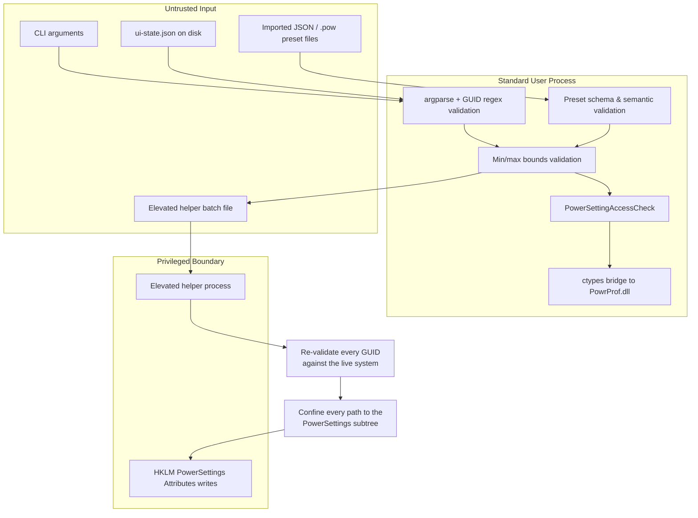

# Threat Model and Security Checklist

* **Document Version:** 2.0.0
* **Target Stack:** Python 3.10+, `ctypes`, `customtkinter` 6.0.0
* **Related Documents:** [[Index]], [[Product Requirements Document]], [[Technical Design Document]], [[Win32 API Reference]], [[CLI and UX Interface Specification]], [[Recovery and Destructive Operations]], [[Build Packaging and Release]]

---

## 1. Trust Boundaries

Four boundaries, one of which is new in v2.0.0 and is now the most security-relevant surface in the product.

**The helper boundary matters most.** It is the only code that runs elevated, and its input arrives via a file on disk — which a local attacker could attempt to race or replace between our write and the helper's read. It therefore re-validates everything rather than trusting a batch file merely because we wrote it.

---

## 2. STRIDE Assessment

| Threat | Vector | Impact | Mitigation |
| :--- | :--- | :--- | :--- |
| **Spoofing** | Malicious parameters passed to `ShellExecuteExW` during elevation to spawn an unintended elevated process. | **High** | `lpFile` is always `os.path.realpath(sys.executable)`. `lpParameters` contains only our own flag plus one quoted path we generated. **No user-supplied string — scheme name, description, search text, file path — is ever interpolated into the command line.** All variable data travels in the batch file, which the helper parses as data, never as arguments. |
| **Spoofing** | A hostile batch file substituted between our write and the helper's read. | **High** | Batch written to a per-user directory with a randomised name; helper re-validates every GUID against the live system via `PowerEnumerate`, confines every computed registry path to the `PowerSettings` subtree, and writes only the `Attributes` value name with only the values `1` or `2`. A path escaping the subtree aborts the batch. |
| **Tampering** | Setting AC/DC values outside hardware limits (e.g. CPU min state 99999%). | **Medium** | Every change is checked against live `PowerReadValueMin` / `PowerReadValueMax` before the write. Out-of-bounds input is rejected with `ValueOutOfBoundsError` and exit code `4`. Sliders cannot produce out-of-range values by construction; this guards CLI and import paths. |
| **Tampering** | A hostile JSON preset from a forum crafted to write unexpected values or GUIDs. | **Medium** | Seven-stage validation before any write ([[Recovery and Destructive Operations]] §7): size cap, schema, GUID pattern, existence on this machine, live bounds check, NUL/length limits, and a **user-confirmed diff preview**. Unknown GUIDs are reported and skipped, never written blind. |
| **Tampering** | Corrupt or hostile `ui-state.json`. | **Low** | Read defensively: any parse error, type mismatch, or out-of-range geometry falls back to defaults. It contains no power data and is never used to drive a privileged operation. |
| **Repudiation** | User makes edits, forgets, then troubleshoots confusing power behaviour. | **Low** | Local rotating log records every scheme and value change ([[Error Handling and Logging]] §6). Windows independently logs power transitions under `Kernel-Power`. **Restore Windows Default Power Schemes** provides a documented recovery path with mandatory backup. |
| **Information Disclosure** | Leakage of user data. | **None** | Power settings are generic hardware metadata. Zero telemetry, zero network capability, zero analytics. Logs deliberately exclude username, machine name, and home directory paths so they are safe to paste into a public issue. |
| **Denial of Service** | Misconfiguring power states (unattended sleep 0, CPU max 50%) causing instability or apparent breakage. | **Medium** | **Warn, do not block** ([[Recovery and Destructive Operations]] §6). These are legitimate settings Windows accepts, and this app exists to expose them. Values with surprising consequences carry inline warnings; hard bounds are still enforced; `PowerRestoreDefaultPowerSchemes` is the failsafe. |
| **Denial of Service** | Runaway enumeration loop hanging a worker or filling the disk with logs. | **Low** | `PowerEnumerate` loops carry a 4096-iteration sanity cap. Logs are hard-capped at 4 MB by rotation. Worker threads are daemonised so they cannot block shutdown. |
| **Elevation of Privilege** | App runs elevated unnecessarily, enlarging the attack surface for its whole session. | **High** | Manifest requests `asInvoker` (ADR-004). The GUI is **never** relaunched elevated. Administrator work is delegated to a short-lived helper that applies one batch and exits (ADR-008). |
| **Elevation of Privilege** | DLL search-order hijacking — a malicious `powrprof.dll` planted beside the executable. | **Medium** | System DLLs are loaded by bare name so the KnownDLLs mechanism resolves them from `System32`. The build sets `SetDefaultDllDirectories(LOAD_LIBRARY_SEARCH_SYSTEM32)` at startup, before any `WinDLL` call. This matters most for the onefile artifact, which runs from `%TEMP%`. |

---

## 3. Security & Hardening Checklist

### 3.1 C-FFI & `ctypes` Memory Safety
* [ ] **Explicit prototypes.** Every bound function declares `argtypes` **and** `restype`. Without them `ctypes` assumes an `int` return and truncates 64-bit pointers on x64.
* [ ] **Strict GUID validation.** All strings converted to `GUID` match `^[0-9a-fA-F]{8}-[0-9a-fA-F]{4}-[0-9a-fA-F]{4}-[0-9a-fA-F]{4}-[0-9a-fA-F]{12}$`. Braced and URN forms are rejected.
* [ ] **Unsigned GUID bytes.** `Data4` is `c_ubyte * 8`, never `wintypes.BYTE`. Signed bytes raise on any value ≥ `0x80`.
* [ ] **Safe deallocation.** Memory allocated by `PowerGetActiveScheme`, `PowerDuplicateScheme`, and `PowerImportPowerScheme` is released via `kernel32.LocalFree` in a `finally` block. Values are copied out before the free.
* [ ] **Buffer sizing.** The two-call protocol handles **both** undersize conventions — `ERROR_MORE_DATA` *and* `ERROR_SUCCESS`-with-larger-size. Treat "returned size > supplied size" as the retry signal regardless of return code.
* [ ] **Buffer lifetime.** Python buffers passed to write APIs are held in a live reference for the call's duration, not just cast to a pointer.
* [ ] **Loop bounds.** Every `PowerEnumerate` loop has a hard iteration cap.
* [ ] **`PowerReadSettingAttributes` return handled correctly** — it returns the attribute value, not a status code.

### 3.2 Privilege Isolation & Elevation
* [ ] **Standard User default.** No elevation for startup, enumeration, scheme CRUD, or AC/DC edits. Manifest is `asInvoker`, never `requireAdministrator`.
* [ ] **No elevated relaunch of the GUI.** Only the helper elevates (ADR-008).
* [ ] **Argument construction.** `ShellExecuteExW` uses the `runas` verb with `lpFile = realpath(sys.executable)`. No user string reaches `lpParameters`.
* [ ] **Helper input revalidation.** GUIDs re-checked against the live system; registry paths confined to the `PowerSettings` subtree; only `Attributes` written, only as `REG_DWORD`, only `1` or `2`.
* [ ] **Helper minimalism.** In helper mode, exactly one argument is parsed. No GUI, no network, no UI-state access. Exits immediately after writing its result.
* [ ] **Temp file hygiene.** Batch and result files use randomised names in a per-user directory and are deleted after the helper exits, including on the error path.
* [ ] **Declined UAC is not an error.** `ERROR_CANCELLED` (1223) reverts the pending change with neutral status text.
* [ ] **Policy locks are not elevation problems.** `PowerSettingAccessCheck` distinguishes them; policy-locked controls render disabled and never offer elevation that cannot help.
* [ ] **CLI never prompts for UAC.** Privileged CLI commands exit `5` with a hint, so a consent dialog cannot break unattended automation.

### 3.3 Input Sanitization
* [ ] **NUL-byte injection.** Names and descriptions passed to `PowerWriteFriendlyName` / `PowerWriteDescription` are checked for `\x00` and rejected.
* [ ] **Length limits.** Scheme names capped at 256 characters, descriptions at 1024, before reaching Win32.
* [ ] **Preset validation.** Imports pass the full validation chain, and the diff preview is confirmed, before the first write.
* [ ] **Preset size cap.** Files over 1 MB or with more than 2048 settings entries are rejected before parsing.
* [ ] **Path handling.** Export and import paths are resolved with `os.path.realpath` and checked to be regular files. No path from a preset file is ever used for file I/O.
* [ ] **No shell execution anywhere.** No `subprocess`, no `os.system`, no `shell=True`, and specifically no `powercfg.exe` invocation (ADR-007).

### 3.4 Build & Distribution
* [ ] **No network libraries.** `socket`, `ssl`, `http`, `urllib`, `requests`, and peers are excluded from the PyInstaller bundle **and** asserted absent by a CI check over the source tree and the frozen module table ([[Build Packaging and Release]] §6.1).
* [ ] **Pinned dependencies.** `requirements.txt` pins exact versions; `--require-hashes` against a generated lock file.
* [ ] **Minimal runtime dependency set.** Three runtime dependencies. Additions require an ADR.
* [ ] **Authenticode signing.** Tagged releases are signed with `/fd SHA256` and a timestamp (`/tr`). Timestamping is mandatory — without it, every shipped release starts warning when the certificate expires.
* [ ] **Checksums published.** `SHA256SUMS.txt` accompanies every release.
* [ ] **UPX disabled.** Compression is a strong antivirus heuristic signal for an unsigned binary that writes to `HKLM` power keys.
* [ ] **DLL search hardening.** `SetDefaultDllDirectories(LOAD_LIBRARY_SEARCH_SYSTEM32)` is called before any `WinDLL` load.
* [ ] **Signing material never in the repository** or in CI secrets in exportable form.

---

## 4. Explicitly Accepted Risks

Documented because an undocumented accepted risk is indistinguishable from an oversight.

| Risk | Why accepted | Mitigation |
| :--- | :--- | :--- |
| **Dependence on undocumented `Attributes = 2`** | The documented API path does not deliver the feature. Shipping a headline feature that silently does nothing is worse. The convention has been stable since Vista and is what Control Panel itself reads. | Reads go through the supported API, so a future Windows change degrades the write path rather than corrupting our view of state. |
| **Dependence on undocumented overlay exports** | Solves a real class of user confusion at low cost. | Read-only. Missing export, unknown GUID, or nonzero return hides the indicator and logs a warning. Never blocks startup or raises a dialog. |
| **No screen-reader support** | A permanent property of the GUI framework (ADR-002). Fixing it means replacing the entire UI layer. | Disclosed prominently to users, who are directed to Windows Settings and `powercfg.exe`, both fully accessible. Keyboard navigation and WCAG AA contrast are supported and tested. |
| **Users can set values that degrade their system** | This app exists to expose deep control. Blocking legitimate settings would defeat its purpose. | Inline hazard warnings, enforced hard bounds, and a documented restore path with mandatory backup. |
| **Global, all-users visibility changes** | The registry layout gives no per-scheme or per-user option. | Moved to a dedicated view with a persistent banner; batched behind an explicit Apply; fully reversible via a recorded prior-state backup. |
| **Unsigned CI builds** | Signing every `main` build is impractical with a hardware-token certificate. | Only tagged releases are signed; CI artifacts are clearly labelled unsigned and are not published as releases. |
| **No native ARM64 build** | PyInstaller cannot cross-compile for Windows ARM64 and no hosted ARM64 runner exists. | The x64 artifact runs under emulation. This app is registry-bound, not compute-bound, so emulation costs little. |

---

## 5. Out of Scope for This Threat Model

* **Physical access attacks.** An attacker with local Administrator can change power settings directly with `powercfg` — this app grants no capability they lack.
* **Windows kernel vulnerabilities.** We call documented Win32 APIs; kernel integrity is Microsoft's boundary.
* **Supply-chain compromise of CPython or CustomTkinter.** Mitigated only to the extent of pinning and hash-checking dependencies.
* **Malicious Group Policy.** An administrator who controls policy already controls power settings by definition.
